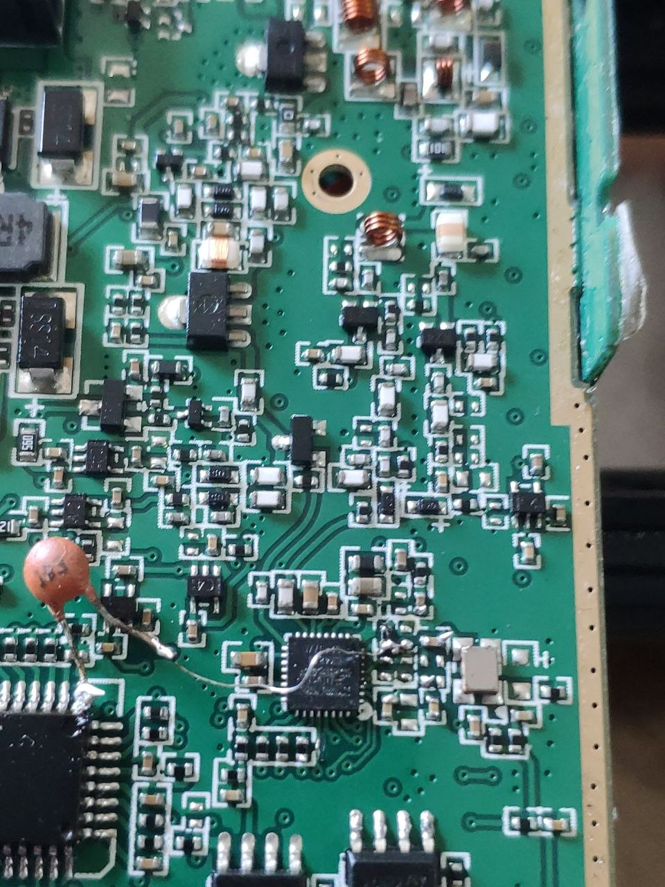
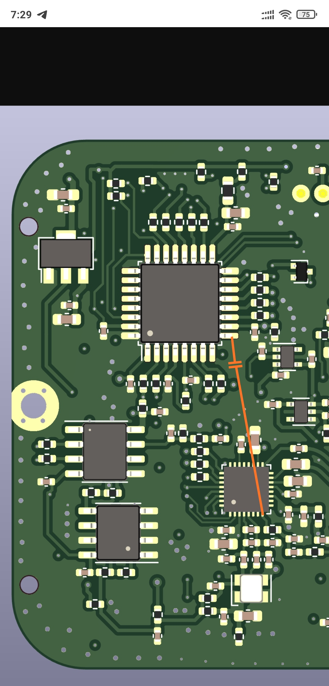

# Quansheng UV-K5 Custom Firmware

This is a highly customized firmware for the Quansheng UV-K5 (and compatible radios), heavily focused on advanced RF functionalities such as **Radiosonde RS41 Decoding**, **SI4732 SSB Reception**, **Spectrum Analysis**, and more. 

All Chinese languages, characters, and fonts have been completely eradicated from this codebase to ensure a **100% English interface**, maximizing the available flash memory for core features.

## ⚠️ 64KB Flash Memory Limitation

The microcontroller (MCU) inside the UV-K5 only has **64KB of Flash memory**. Due to this physical limitation, **it is impossible to enable all features at the same time**. 

To work around this, you must compile specific features by enabling/disabling them in the `Makefile`. If you want to use the Radiosonde RS41 decoder, other non-essential features (like VOX, Alarm, Flashlight, or SMS) must be disabled.

## 🚀 Build Automation (`build_releases.sh`)

To make compiling easier, we have provided an automated build script: `build_releases.sh`.
By running this script, the compiler will automatically build **5 different firmware variations**, each tailored for a specific use case, and save them as independent `.bin` files:

1. **`firmware_original.bin` (~45 KB)**
   - Stock features (Flashlight, Alarm, UART, VOX, etc.) restored.
2. **`firmware_si4732_ssb.bin` (~53 KB)**
   - Specialized for radio listening. Enables the SI4732 sound chip and SSB mode.
3. **`firmware_rs41.bin` (~52 KB)**
   - Specialized for weather balloon hunting. Enables the **Radiosonde RS41 Decoder** (automatically disables Flashlight/Alarm/VOX to save space).
4. **`firmware_si4732_rs41.bin` (~60 KB)**
   - **The All-in-One Build:** Includes both the RS41 Decoder and SI4732/SSB radio capabilities. This build is right at the 60KB limit!
5. **`firmware_addons.bin` (~56 KB)**
   - Utility build featuring **Spectrum Analyzer**, **Doppler Satellite Tracking**, and **SMS Messenger**.

To generate these files, simply run:
```bash
./build_releases.sh
```

## 🛠️ Flashing the Firmware

Because this project is designed for single-boot setups, you simply flash the specific `.bin` file you need for the day.
You can use `k5prog` to flash the firmware directly via the USB-C programming cable:

```bash
./k5prog_src/k5prog -p /dev/ttyUSB0 -F -YYY -b firmware_rs41.bin
```
*(Replace `/dev/ttyUSB0` with your actual serial port).*

## 📖 Feature Details

### Radiosonde RS41 Decoder
[Detailed Hardware Modification & Usage Guide](doc/RADIOSONDE.md)




Requires a hardware mod (tapping the discriminator output from BK4819 Pin 8 to MCU Pin 9 - PA8). Decodes live telemetry, GPS coordinates, and generates a dynamic QR Code for immediate smartphone map integration.

### CW Morse Decoder & Transmitter
Does not require any hardware modification. Works by reading the BK4819 RSSI register at high speed.
* **Decoder**: Automatic WPM estimation and text decoding from FM signals, tracking noise floor dynamically.
* **Keyboard Text Entry**: Multi-tap alphanumeric text editor with backspace (STAR key).
* **Automated Morse Transmission**: Type a message and press MENU to transmit it automatically. Shows real-time flashing LED and screen indicator matching the code.
* **Manual Paddles**: Press Side Key 1 for dit and Side Key 2 for dah.
* **Speaker Audio Output (F key)**: Toggle speaker between Sound On (`SON`) and Mute (`MUT`). *Note: Due to stock hardware constraints, the tone generator outputs ticking/clicking sounds rather than a pure audio tone on the transmitter speaker; this is a known limitation.*


### Operating Instructions / Shortcuts

| Key | Function |
|---|---|
| **`UP` / `DOWN`** | Adjust frequency (step size configurable). |
| **`0` - `9`** | Quickly input frequency in frequency mode. |
| **Long Press `M`** | Switch modulation mode (FM/AM/USB). |
| **Long Press `*`** | Scan mode. |
| **Long Press `0` / `F+0`** | Open/Close SI4732 Radio receiver. |
| **Long Press `1` / `F+1`** | Copy current channel to another VFO. |
| **Long Press `2` / `F+2`** | Switch between A/B channels. |
| **Long Press `3` / `F+3`** | Switch between Frequency (VFO) / Channel (MR) mode. |
| **Long Press `6` / `F+6`** | Switch transmit power. |
| **Long Press `8` / `F+8`** | Reverse frequency. |
| Long Press `9` | **Open CW Morse Decoder + Keyer** (if compiled). |
| **`F+9`** | **Open RS41 Radiosonde Decoder** (if compiled). |
| **`F+5`** | Spectrum Analyzer (if compiled). |
| **`F+M`** | Open SMS Messenger (if compiled). |
| **`F+UP`** | Toggle key tone. |
| **`F+DOWN`** | Automatic Doppler shift (if compiled). |
| **`F+EXIT`** | Invert menu navigation (Up/Down). |

### CW Mode Shortcuts (When Enabled)

| Key | Function |
|---|---|
| **`0` - `9`** | Multi-tap alphanumeric text entry (Nokia style). |
| **`STAR (*)`** | Backspace (delete last character from buffer). |
| **`MENU`** | Send the composed text automatically over the air (M=TX). |
| **`F` (# key)** | Toggle local speaker sound output (`SON` for sound on, `MUT` for silent RX decoding and TX transmission). |
| **`UP` / `DOWN`** | Adjust WPM speed (5 to 40 WPM). |
| **`Side Key 1`** | Send custom manual **dit** (.) tone. |
| **`Side Key 2`** | Send custom manual **dah** (-) tone. |
| **`EXIT`** | Abort automatic transmission if active; exits CW mode if idle. |


### SI4732 Radio Shortcuts (When Enabled)


| Key | Function |
|---|---|
| **Short press `Side Key 1`, Short press `Side Key 2`** | Change BFO in SSB mode |
| **Short press `5`** | Enter frequency, **short press `*`** for decimal point, **short press `MENU`** to confirm |
| **Short press `0`** | Switch mode (AM/FM/SSB), **short press `F`** to switch LSB/USB |
| **Short press `*` / `MENU`** | **Save Preset Screen** (Use `<` / `>` to browse list, `MENU` to confirm save, `1`-`9` to jump, `EXIT` to cancel). |
| **F + 0** | **Radio List Screen** (Use `<` / `>` to browse list, `MENU` to confirm load, `1`-`9` to jump, `EXIT` to cancel). |
| **Short press `1`, Short press `7`** | Change step frequency |
| **Short press `4`** | Toggle signal strength display |
| **Short press `6`** | Change bandwidth |
| **Short press `2`, Short press `8`** | Toggle ATT |
| **Short press `3`, Short press `9`** | Search up/down, **short press `EXIT`** to stop search |

### Doppler Mode Shortcuts (When Enabled)

| Key | Function |
|---|---|
| **Short press `5`** | Enter time, **short press `*`** for decimal point, **short press `MENU`** to confirm |
| **Short press `MENU`** | Toggle parameters, adjust up/down |
| **Short press `PTT`** | Transmit |
| **Short press `Side Key 1`** | Enable listening |
## ⚙️ Makefile Compilation Options

If you wish to compile your own custom variations manually, you can pass flags directly to `make`. 
*(Note: `ENABLE_ENGLISH=1` is enabled by default in the Makefile).*

```bash
make clean && make build ENABLE_RS41=1 ENABLE_4732=1 ENABLE_4732SSB=1
```

**Common Flags:**
- `ENABLE_RS41=1` : Radiosonde Decoder
- `ENABLE_4732=1` : SI4732 Radio Support
- `ENABLE_4732SSB=1` : SSB Support
- `ENABLE_SPECTRUM=1` : Spectrum Analyzer
- `ENABLE_DOPPLER=1` : Satellite Doppler Tracking
- `ENABLE_MESSENGER=1` : SMS capabilities
- `ENABLE_UART=1` : Enable PC programming (Chirp/K5Prog)

## 🧠 EEPROM Layout Explanation

| Eeprom Address | Description |
|---|---|
| **0x01D00 ~ 0x02000** | Rarely changed. |
| **0x01D00 ~ 0x01E00<br/>0x1F90 ~ 0x01FF0** | **MDC1200** - 22 MDC contacts. Each contact occupies 16B (first 2B: MDC ID, next 14B: contact name). |
| **0x01900 ~ 0x0193B** | **SI4732 Presets** - 20 quick-access slots (3 bytes each: 2B frequency, 1B modulation mode). |
| **0x01F70 ~ 0x01F7F** | **Radiosonde Tracker** - Saved telemetry data of the last decoded weather balloon. |
| **0x01FFF** | **MDC1200** - Number of MDC contacts. |
| **0x01FFD ~ 0x01FFE** | **MDC1200** - MDC ID. |
| **0x01FF8 ~ 0x01FFC** | Side key functions. |
| **Expanded EEPROM (≥1Mib)** | |
| **0x02000 ~ 0x02025** | Custom Boot Characters. |
| **0x02080 ~ 0x02480** | Custom Boot Screen (128 * 64/8 = 1024 bytes). |
| **0x02480 ~ 0x02B96** | Custom Fonts (BigDigits, 3x5, Small) and Menu encoding. |
| **0x02BA0 ~ 0x02BA9** | **Doppler** - Satellite names (up to 9 chars). |
| **0x02BAA ~ 0x02BB5** | **Doppler** - Start transit time and departure time (YY-MM-DD-HH-MM-SS). |
| **0x02BB6 ~ 0x02BBB** | **Doppler** - Total transit time, Transmitter sub-audio, Receiver sub-audio. |
| **0x02C00 ~ 0x02D34** | **Doppler** - CTCSS_Options and DCS_Options. |
## Credits

This project is a customized fork built upon the incredible work of the following open-source projects:

- **[Dual Tachyon](https://github.com/DualTachyon/uv-k5-firmware)**: The original open-source firmware for the Quansheng UV-K5.
- **[losehu](https://github.com/losehu/uv-k5-firmware-custom)**: Provided the foundational base for advanced features such as the SI4732 integration and the expanded feature set.
- **[OneOfEleven](https://github.com/OneOfEleven/uv-k5-firmware-custom)**: Significant code optimizations and feature enhancements.

Special thanks to the global UV-K5 development community for their continuous contributions to this platform.

## Disclaimer

Flashing custom firmware carries inherent risks. You are responsible for ensuring your radio operates within the legal limits of your local regulations.
