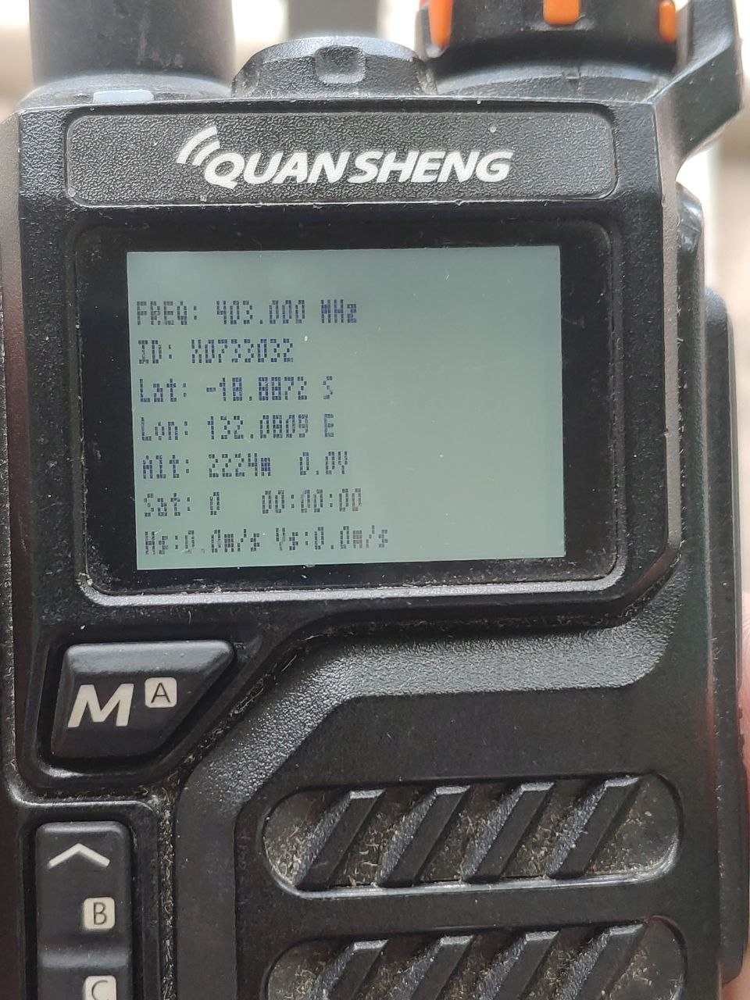
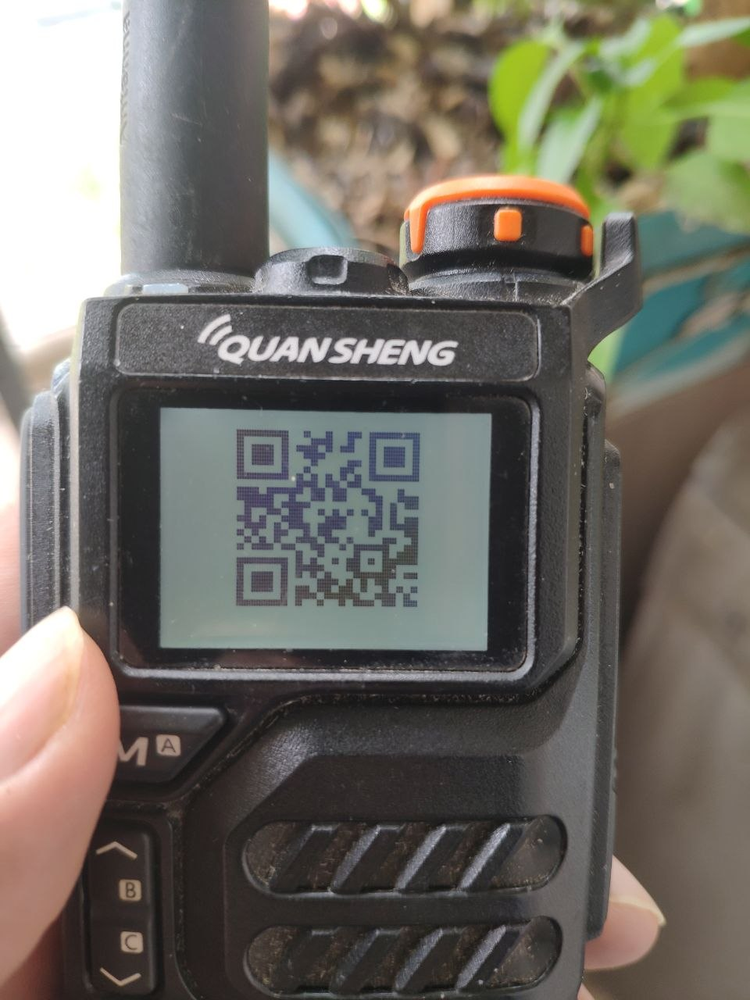

# Quansheng UV-K5 Radiosonde (RS41) Decoder

This document outlines the hardware modifications and software implementations required to decode RS41 weather balloon (Radiosonde) telemetry directly on the Quansheng UV-K5.

## Hardware Modification (Discriminator Tap)

To successfully decode the RS41's 4800 baud GFSK telemetry, the MCU needs access to the raw, unfiltered audio signal (discriminator output) from the BK4819 radio IC. The standard audio path passes through HPF/LPF filters and de-emphasis which distorts the digital waveform.

**Required Mod:**
You must connect **Pin 6 (EARO)** of the BK4819 to **PA8** of the DP32G030 MCU via a **DC-blocking capacitor** (e.g., 100nF). This bypasses the internal audio filters and provides a clean waveform to the MCU's ADC for processing.

> **Note:** Previously, Pin 28 (GPIO0) was tested, but using Pin 6 allows the `RX_ENABLE` circuit and LNA to function normally, significantly improving reception range.

## Software Features

The firmware utilizes a custom zero-crossing DPLL (Digital Phase Locked Loop) running on the ADC samples to synchronize and extract the digital frames.

### Radiosonde Monitor Screen
Once the signal is locked, the radio displays live telemetry from the weather balloon:
- **Lat / Lon**: Latitude and Longitude (Calculated from RS41 ECEF data).
- **Alt**: Altitude in meters.
- **Sat**: Number of GPS satellites tracked by the balloon. *(Note: If Sat=0, the balloon has no GPS lock and the coordinates will be invalid/factory defaults).*
- **Hs / Vs**: Horizontal and Vertical velocity.

### QR Code Fast Export
To make retrieving the balloon easier, you can switch the display to show a dynamic QR Code. Scanning this code with a smartphone will immediately open your map application (Google Maps, Apple Maps, etc.) with a pin dropped at the balloon's coordinates.

- **Aspect Ratio Correction**: The UV-K5 LCD has rectangular (non-square) pixels. The firmware uses a precise **3x2 integer scaling** algorithm to ensure the QR code renders as a perfect physical square.
- **Quiet Zones**: The QR code is specifically offset (`offset_y = 6`) to clear the physical black bezel of the screen, ensuring standard white quiet zones are maintained for 100% reliable scanning under any lighting condition.

